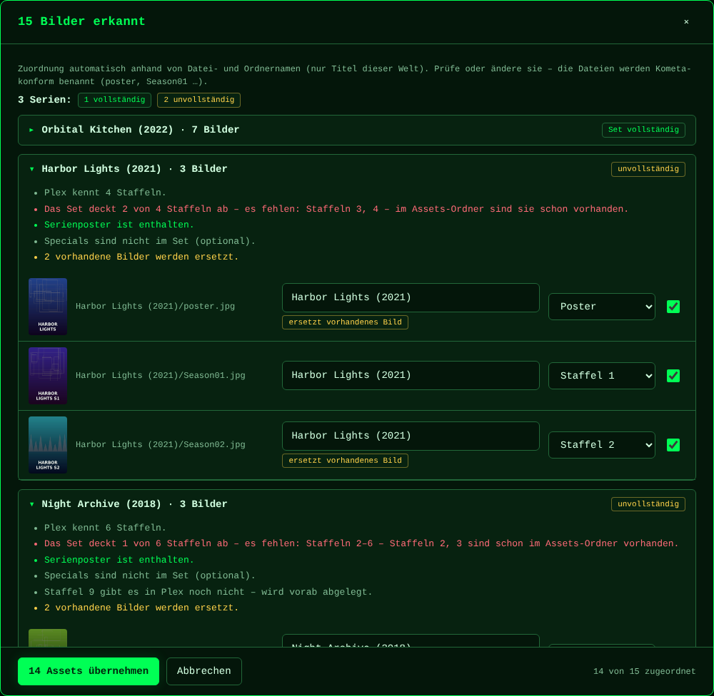
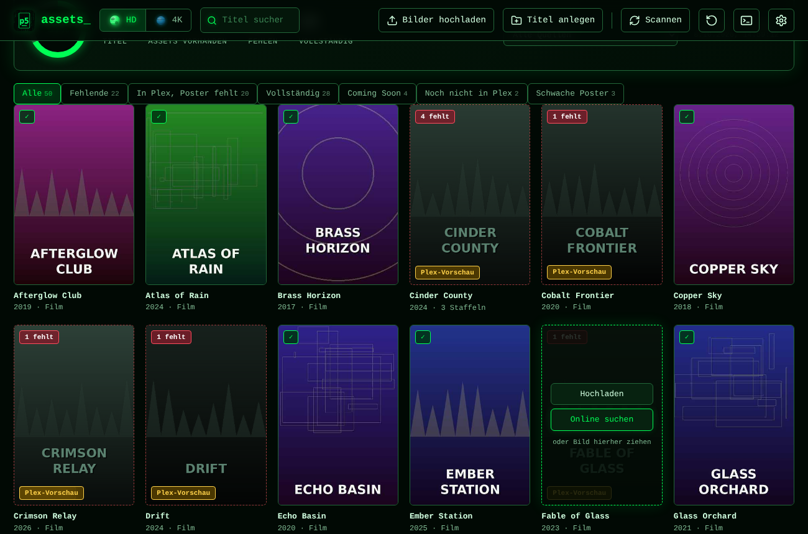
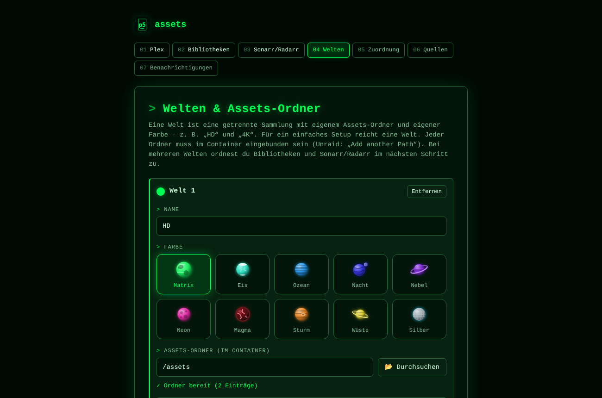
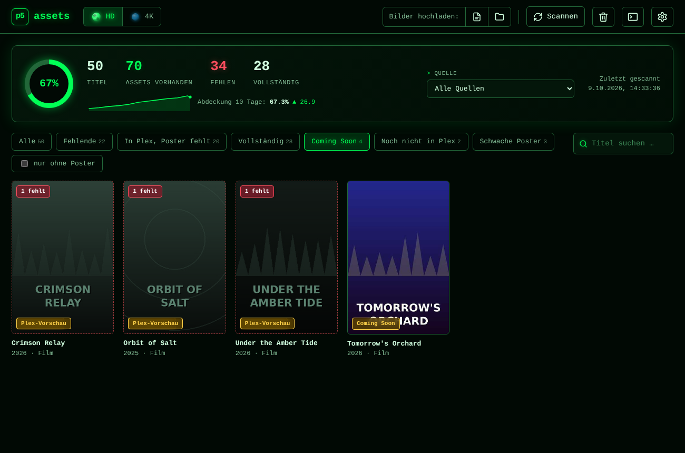
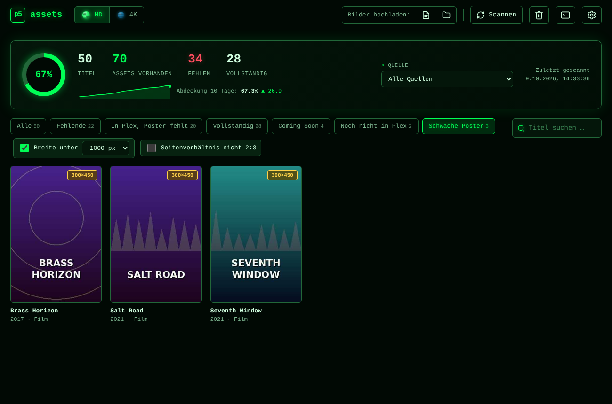
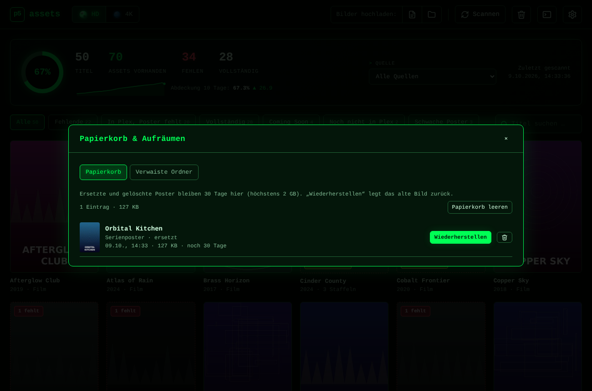
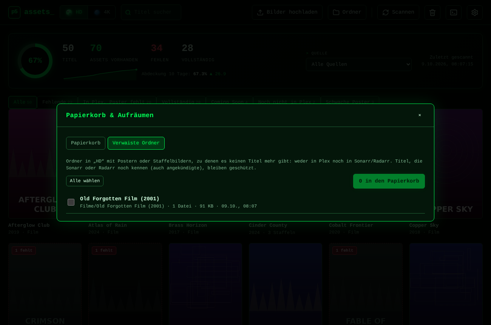
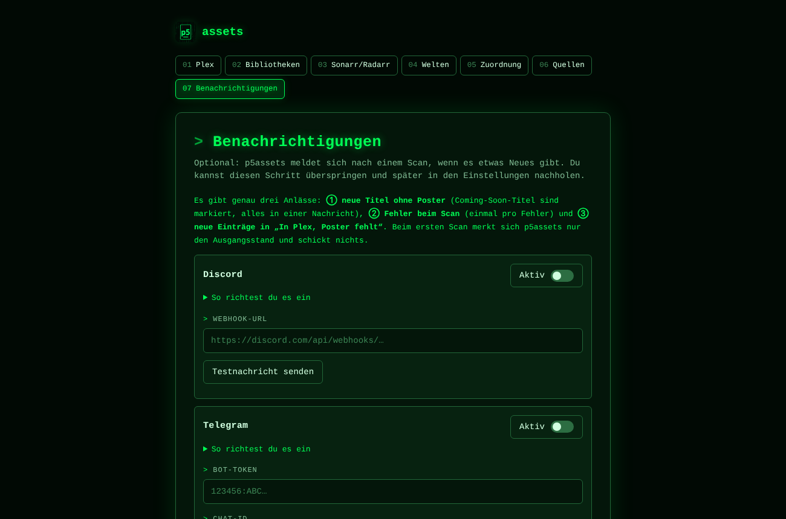
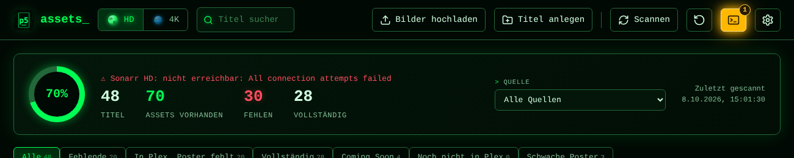
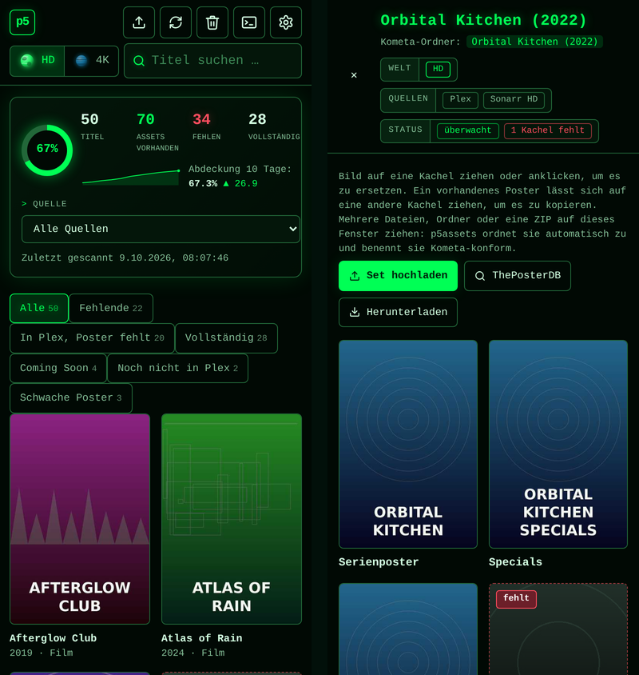

<div align="center">


# p5assets

**Fehlende Poster und Staffelcover für Plex, Sonarr, Radarr und Kometa – finden, ersetzen, fertig.**

Ein schlanker Docker-Container im Matrix-Look. Er vergleicht deine Bibliotheken mit dem
[Kometa](https://kometa.wiki)-Assets-Ordner, zeigt dir, was fehlt, und legt neue Bilder automatisch Kometa-konform ab.


-ffcc00?labelColor=0a1a0f)


<sub>Alle Titel in den Bildern sind erfunden.</sub>

</div>

> *English in short:* p5assets is a self-hosted web UI that scans Plex (plus optional Sonarr/Radarr) for missing
> posters and season posters, lets you replace them by drag & drop (single files, folders, ZIPs) and writes them with
> Kometa-compatible names (`poster.jpg`, `Season01.jpg`, …). It supports multiple "worlds" (e.g. HD and 4K), per-world
> language priorities, TMDb/TVDB/fanart.tv search, "Coming Soon" poster mirroring, an undo trash, quality checks and
> Discord/Telegram/ntfy notifications. Docker image: `ghcr.io/p5lukas/p5assets:dev`, default port 8484.

## Funktionen

### Lücken finden
Plex, Sonarr und Radarr werden zusammengeführt (über TMDb/TVDB/IMDb-IDs). Reiter zeigen sofort, was zu tun ist:
**Fehlende**, **In Plex, Poster fehlt**, **Vollständig**, **Coming Soon**, **Noch nicht in Plex** (Sonarr/Radarr kennen den Titel, Plex noch nicht) und **Schwache Poster**.
Dazu eine Quellenauswahl, schnelle Suche (rechts neben den Reitern), A–Z-Leiste und eine Abdeckungsanzeige mit kleinem Verlauf pro Scan.
Große Bibliotheken sind kein Problem: mit über 6000 Titeln antworten die Listen in rund 30 ms.

### Ersetzen per Drag & Drop
Ein Bild auf eine Kachel, mehrere Dateien, ganze Ordner oder ZIPs irgendwo ins Fenster ziehen – – oder über „Bilder hochladen:“ in der Kopfzeile auswählen (Datei-/ZIP-Symbol oder Ordner-Symbol; auf iPhone und iPad gibt es einen einzelnen Knopf, Ordner gehen dort als ZIP). p5assets erkennt Titel,
Jahr und Staffel aus Datei- und Ordnernamen, zeigt die Zuordnung zur Kontrolle und benennt alles Kometa-konform
(`<Medienordner>/poster.jpg`, `Season01.jpg` …). Neue Ordner landen dort, wo die anderen Titel schon liegen.

**Set-Kontrolle beim Import:** Enthält ein Upload ein Serien-Set (auch mehrere Serien in einer ZIP, nach Serie gruppiert), prüft p5assets
für jede Serie, wie viele Staffeln Plex (und Sonarr) kennen, ob das Set alle abdeckt, ob das Serienposter und die Specials dabei sind
und welche vorhandenen Bilder ersetzt würden.



<table>
<tr>
<td width="50%"><br><sub>Staffelposter ergänzen – Matrix-Regen nur dort, wo sich etwas ändert</sub></td>
<td width="50%"><br><sub>ZIP hochladen: automatische Zuordnung, Abdeckung steigt</sub></td>
</tr>
</table>

### Filme und Serien
<table>
<tr>
<td width="50%"><br><sub>Filme direkt am Poster bearbeiten (am Touchscreen per Tippen)</sub></td>
<td width="50%"><br><sub>Serien: Poster und Staffeln, <b>Set hochladen</b>, ThePosterDB-Link, ZIP-Download</sub></td>
</tr>
</table>

- Kacheln für Poster und **Season00 – Season50**, auch für Staffeln, die es noch nicht gibt
- Poster per Drag & Drop auf eine andere Kachel **kopieren**, oder mit **„Auf alle …“** auf mehrere Kacheln übertragen
- **Herunterladen** in Originalqualität: einzelne Poster oder eine Auswahl als ZIP (auf iPhone/iPad öffnet sich das Original in p5assets: Bild lange drücken → „Zu Fotos hinzufügen“)

### Online-Suche
Poster von TMDb, TVDB und fanart.tv, gruppiert nach deiner **Sprach-Priorität pro Welt** (z. B. Textless → Deutsch → English),
Übernahme per Klick. Für ThePosterDB öffnet ein Link die Suche mit dem passenden Namen; das dort heruntergeladene Poster
oder Set legst du einfach in p5assets ab (kein Login, kein Auslesen der Seite).


### Welten (HD, 4K, …)
Getrennte Bereiche mit eigenem Assets-Ordner, eigener Titelliste, eigenem Dashboard und **eigener Farbe**: zehn Welten
zur Auswahl, jede mit eigenem Planeten in der Kopfzeile; der Wechsel ist eine kurze Wurmloch-Reise. Bibliotheken und
Sonarr-/Radarr-Instanzen ordnest du den Welten per Drag & Drop zu.

<table>
<tr>
<td width="50%"><br><sub>Weltenwechsel HD ↔ 4K</sub></td>
<td width="50%"><br><sub>Zehn Welten mit eigenem Planeten</sub></td>
</tr>
</table>

### Coming Soon
Plex-Platzhalter mit `{edition-Coming Soon}` im Ordnernamen haben einen eigenen Reiter (auf Wunsch nur die ohne Poster).
Ihre Poster werden zusätzlich im echten Radarr-/Sonarr-Ordner abgelegt (pro Welt abschaltbar), damit sie den Wechsel
auf die echte Datei überleben. Andere Editionen bleiben getrennt.



### Qualität prüfen: Schwache Poster
Der Reiter findet zu kleine oder nicht 2:3 große Bilder. Die Schwellwerte (Mindestbreite, Seitenverhältnis) wählst du selbst;
die Bildgrößen werden im Hintergrund gelesen.



### Papierkorb & Aufräumen
Ersetzte oder gelöschte Poster liegen **30 Tage im Papierkorb** (höchstens 2 GB). Nach jeder Aktion bietet ein Hinweis
„Rückgängig“ an; das Papierkorb-Symbol in der Kopfzeile öffnet die ganze Liste. **Verwaiste Ordner** (Poster ohne Titel in Plex,
Sonarr/Radarr) lassen sich finden und in den Papierkorb verschieben; Titel, die Sonarr/Radarr
noch kennen, bleiben geschützt.

<table>
<tr>
<td width="50%"><br><sub>Papierkorb mit Wiederherstellen</sub></td>
<td width="50%"><br><sub>Verwaiste Ordner aufräumen</sub></td>
</tr>
</table>

### Benachrichtigungen
Nach einem Scan meldet p5assets per **Discord, Telegram oder ntfy** – und nur bei drei Anlässen:
neue Titel ohne Poster (Coming-Soon-Titel werden mitgezählt: „4 neue Titel ohne Poster, 2 davon Coming Soon“),
Fehler beim Scan (einmal pro Fehler) und neue Einträge unter „In Plex, Poster fehlt“. Der erste Scan legt nur den
Ausgangsstand fest. Einrichten im Onboarding (überspringbar) oder später in den Einstellungen, mit Testnachricht.



### Logs, Neuigkeiten, Mobil
- **Log-Seite** (Symbol `>_`): Live-Log mit Suche, Level-Filter und Download. Bei neuen Warnungen oder Fehlern leuchtet das Symbol auf und zeigt die Anzahl. Tokens und API-Keys werden nie protokolliert.
- **Neu in diesem Update**: nach einem Update zeigt p5assets, was neu ist, und bietet neue Funktionen direkt zum Einrichten an (später jederzeit über „Neuigkeiten“ in der Fußzeile).
- **Als App** auf iPhone/iPad (Teilen → Zum Home-Bildschirm), mit kompakter Kopfleiste und großen Tippflächen.

<table>
<tr>
<td width="50%"><br><sub>Log-Symbol mit Alarm und Hinweis im Dashboard</sub></td>
<td width="50%"><br><sub>Mobil / iPhone</sub></td>
</tr>
</table>

## Schnellstart (Docker Compose)
```yaml
services:
  p5assets:
    image: ghcr.io/p5lukas/p5assets:dev
    ports: ["8484:8080"]
    environment: { PUID: 99, PGID: 100, UMASK: "002", TZ: Europe/Berlin }
    volumes:
      - ./config:/config
      - /pfad/zu/kometa/assets:/assets          # Welt 1 (z. B. HD) – muss dein Kometa asset_directory sein
      - /pfad/zu/kometa/assets-4k:/assets-4k    # optional: Welt 2 (4K)
    restart: unless-stopped
```
Dann http://localhost:8484 öffnen und das Onboarding durchlaufen (Plex, Welten, Sonarr/Radarr, API-Keys).
Die Assets-Ordner müssen **beschreibbar** gemountet sein. Ordnernamen werden aus dem Medienpfad in Plex bzw.
Sonarr/Radarr abgeleitet – so sucht Kometa die Assets.

Aus dem Quellcode: `docker compose up -d --build`.

## Unraid
1. Template **und Icon** auf den Server bringen. Am einfachsten per Netzwerkfreigabe (funktioniert auch bei privatem Repo):
   `unraid/p5assets.xml` → `\\<Unraid-IP>\flash\config\plugins\dockerMan\templates-user\my-p5assets.xml`
   (Alternativ bei öffentlichem Repo per Terminal:
   `wget -O /boot/config/plugins/dockerMan/templates-user/my-p5assets.xml https://raw.githubusercontent.com/p5lukas/p5assets/dev/unraid/p5assets.xml`)
2. *Docker → Add Container* → Template **p5assets** unter *User templates* wählen.
3. Pfade setzen: **Config** (z. B. `/mnt/user/appdata/p5assets`), **Assets 1** (dein Kometa-`asset_directory`),
   bei Bedarf **Assets 2** (z. B. 4K). Nicht benötigte Assets-Pfade leer lassen.
4. Der Host-Port ist standardmäßig **8484**. Ist er belegt, ändere nur den Host-Port, nicht den Container-Port 8080.
5. WebUI öffnen und das Onboarding durchlaufen. Als Plex-URL trägst du `http://<Unraid-IP>:32400` ein.

### Image-Tags
| Tag | Quelle | Zweck |
|---|---|---|
| `:dev` | Branch `dev` | Neues testen |
| `:latest` | Branch `main` | stabil |
| `:0.3.0` | Git-Tag `v0.3.0` | feste Version (aktuell `0.3.0`, `1.0.0` erst bei ausgereiftem Stand) |
| `:sha-…` | jeder Build | Fehlersuche |

Solange p5assets in der Entwicklung ist, nutzen Template und Compose-Datei `:dev`. Sobald alles stabil läuft,
wird auf `:latest` (Branch `main`) umgestellt: im Container-Formular das Feld *Repository* auf
`ghcr.io/p5lukas/p5assets:latest` ändern.

> Ist das GHCR-Paket privat, braucht Unraid einen Login: `docker login ghcr.io -u p5lukas` mit einem Token, der **nur** `read:packages` darf.

Der Build läuft per GitHub Action (`.github/workflows/docker.yml`) bei Push auf `dev` bzw. `main`.
Dateien werden mit `PUID=99` / `PGID=100` (nobody/users) geschrieben.
Updates: Container in Unraid mit *Force Update* aktualisieren.

## Speicherbedarf in `/config`
| Ordner | Inhalt | Größe |
|---|---|---|
| `config.json` | Einstellungen, Zugangsdaten (Token/API-Keys, nie im Log) | klein |
| `cache/thumbs-v3` | Vorschaubilder für schnelle Listen | höchstens 600 MB, wird automatisch bereinigt |
| `trash` | Papierkorb mit Rückgängig-Funktion | höchstens 2 GB, 30 Tage |
| `cache/dims.json`, `history.json`, `logs` | Bildgrößen, Abdeckungsverlauf, Log | klein |

## Hinweis
Es gibt keine eigene Anmeldung – betreibe p5assets nur im Heimnetz oder hinter einem Reverse Proxy mit Login.
Plex-Token, API-Keys und Benachrichtigungs-Zugangsdaten liegen in `/config/config.json` und werden nie ins Log geschrieben.
Verbindungen zu Plex, Sonarr und Radarr im Heimnetz akzeptieren selbstsignierte Zertifikate (üblich bei `https://` im LAN); die Online-Suche und Benachrichtigungen im Internet nutzen die normale Zertifikatsprüfung.

Die Tests (`pytest`) laufen in der GitHub-Action vor jedem Image-Bau.

## Lizenz
p5assets steht unter der [GNU General Public License v3.0](LICENSE) (GPL-3.0): Du darfst den Code nutzen, ändern und weitergeben.
Weiterentwicklungen, die du verbreitest, müssen ebenfalls unter der GPL-3.0 stehen und ihren Quellcode offenlegen.
Das Projekt ist unabhängig von Plex, Sonarr, Radarr, Kometa, TMDb, TVDB, fanart.tv und ThePosterDB und nicht mit ihnen verbunden.
