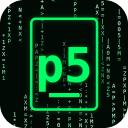
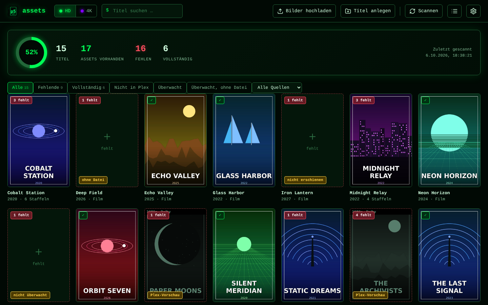
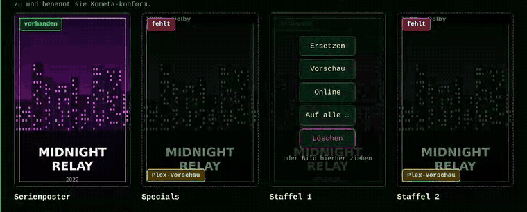
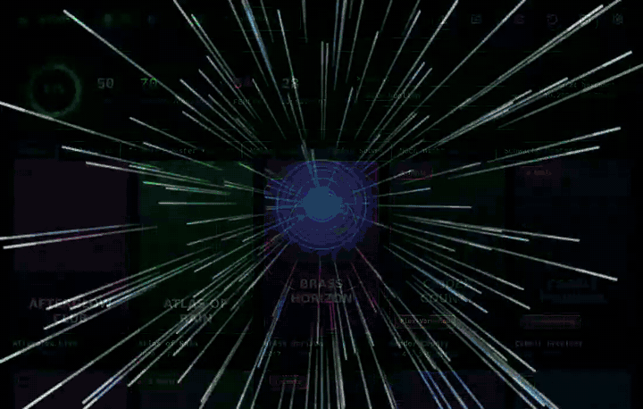
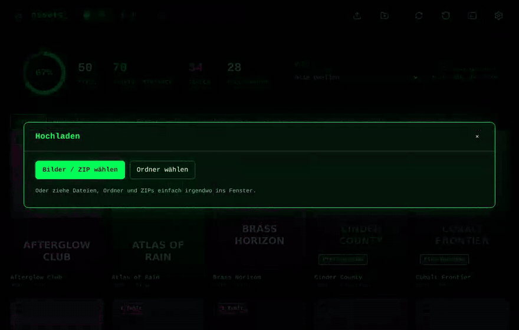
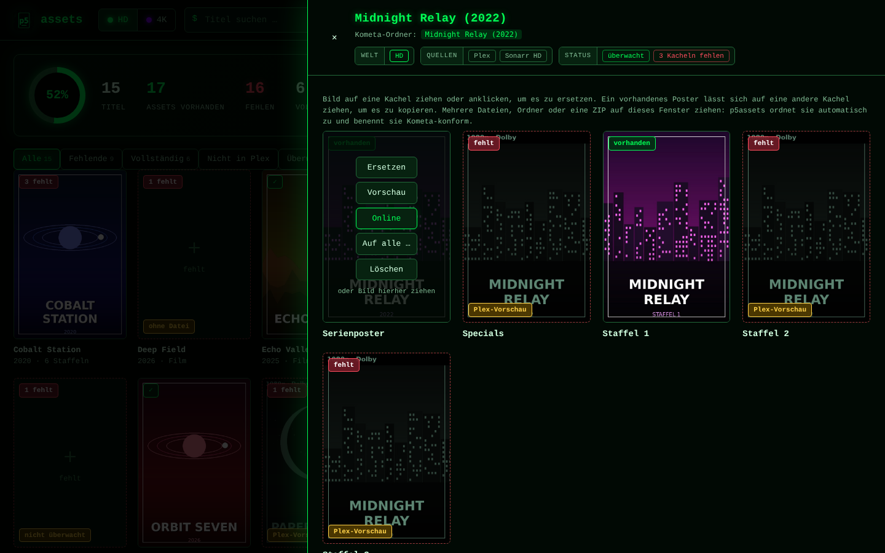
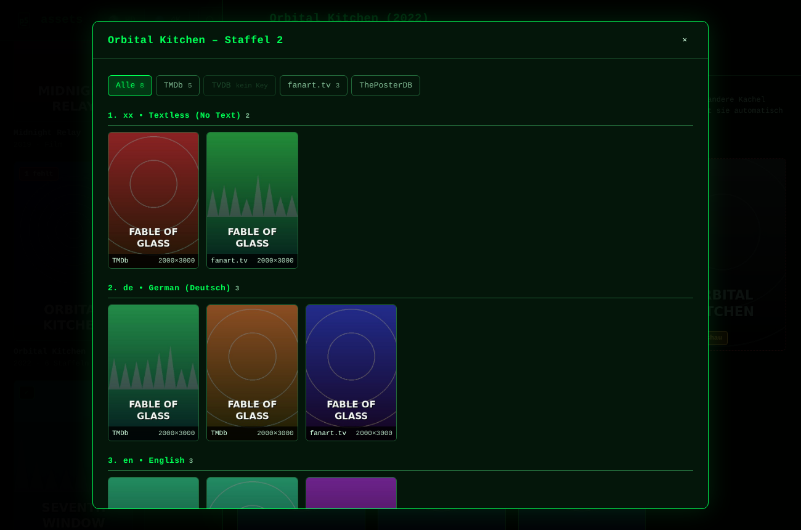
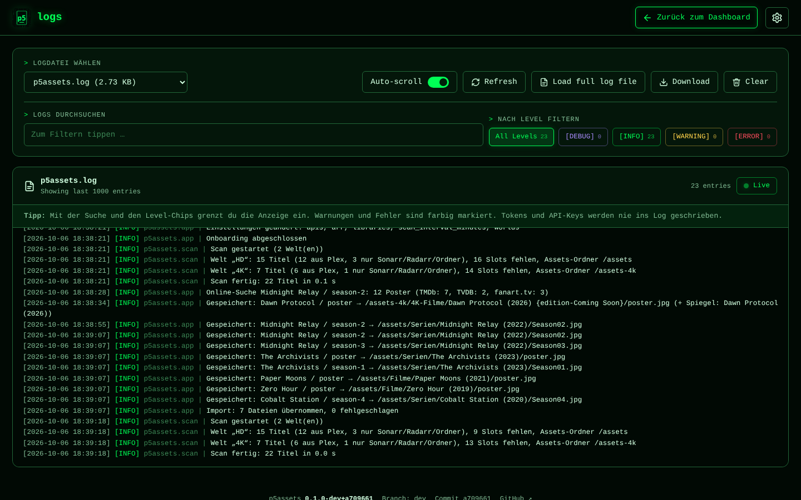

<div align="center">



# p5assets

**Fehlende Poster und Staffelcover für Plex, Sonarr, Radarr und Kometa – finden, ersetzen, fertig.**

Ein schlanker Docker-Container im Matrix-Look. Er vergleicht deine Bibliotheken mit dem
[Kometa](https://kometa.wiki)-Assets-Ordner, zeigt dir, was fehlt, und legt neue Bilder automatisch Kometa-konform ab.


-ffcc00?labelColor=0a1a0f)



</div>

> *English in short:* p5assets is a self-hosted web UI that scans Plex (plus optional Sonarr/Radarr) for missing
> posters and season posters, lets you replace them by drag & drop (single files, folders, ZIPs) and writes them with
> Kometa-compatible names (`poster.jpg`, `Season01.jpg`, …). It supports multiple "worlds" (e.g. HD and 4K), per-world
> language priorities, TMDb/TVDB/fanart.tv search and UMTK "Coming Soon" mirroring. Docker image:
> `ghcr.io/p5lukas/p5assets:dev`, default port 8484.

## Auf einen Blick

- 🔎 **Findet Lücken** – Plex, Sonarr und Radarr werden zusammengeführt (über TMDb/TVDB/IMDb-IDs), fehlende Poster und Staffeln sofort sichtbar.
- 🖼️ **Ersetzen per Drag & Drop** – einzelnes Bild, mehrere Dateien, ganze Ordner oder ZIPs.
- 🏷️ **Kometa-konforme Benennung** – automatisch: `<Medienordner>/poster.jpg`, `Season00.jpg` … `Season50.jpg`.
- 🌍 **Welten** – z. B. HD und 4K mit eigenem Assets-Ordner, eigener Farbe, eigener Sprachliste.
- 🌐 **Online-Suche** – TMDb, TVDB und fanart.tv, gruppiert nach deiner Sprach-Priorität.
- 🧠 **Intelligente Zuordnung** – Titel, Jahr und Staffel werden aus Datei- und Ordnernamen erkannt.

## So sieht es aus

<table>
<tr>
<td width="50%"><br><sub>Poster ersetzen: Matrix-Regen nur dort, wo sich etwas ändert</sub></td>
<td width="50%"><br><sub>Welt wechseln: HD ↔ 4K mit eigener Farbe</sub></td>
</tr>
<tr>
<td><br><sub>ZIP oder Ordner ins Fenster ziehen: automatische Zuordnung</sub></td>
<td><br><sub>Detailansicht für Poster und Staffeln</sub></td>
</tr>
<tr>
<td><br><sub>Online-Suche nach Sprachen gruppiert</sub></td>
<td><br><sub>Log-Seite mit Suche und Filter</sub></td>
</tr>
</table>

## Funktionen im Detail
- Onboarding: Plex-Login (PIN) oder URL + Token, Bibliotheken, Sonarr/Radarr, Welten mit Assets-Ordnern, TMDb/TVDB/fanart.tv
- **Welten** (z. B. HD und 4K): getrennte Bereiche mit eigenem Assets-Ordner, eigener Titelliste, eigenem Dashboard und
  **eigener Farbe** (die ganze Oberfläche färbt sich um). Bibliotheken und Sonarr-/Radarr-Instanzen ordnest du per
  Drag & Drop in Bubbles einer Welt zu. Umschalten per Matrix-Animation.
- **Sonarr & Radarr** (beliebig viele Instanzen): auch Titel und Staffeln, die noch nicht in Plex sind – Poster lassen sich schon im Voraus ablegen
- **Überwachung sichtbar**: Titel aus Sonarr/Radarr zeigen „überwacht“, „ohne Datei“ oder „nicht erschienen“; Filter „Überwacht“ und „Überwacht, ohne Datei“; pro Instanz lassen sich nicht überwachte Titel ausblenden
- **UMTK / Coming Soon**: Poster für Plex-Platzhalter mit `{edition-Coming Soon}` werden zusätzlich im echten Radarr-/Sonarr-Ordner abgelegt (pro Welt abschaltbar); andere Editionen bleiben getrennt
- **Eigene Ordner**: Poster für Titel ablegen, die weder in Plex noch in Sonarr/Radarr stehen
- Detailansicht mit Kacheln für Poster und **Season00 – Season50**, auch für Staffeln, die es noch nicht gibt
- Vorhandene Poster per Drag & Drop auf eine andere Kachel **kopieren** (z. B. Staffel 1 → Staffel 2, automatisch umbenannt)
- **„Auf alle …“**: ein vorhandenes Bild für mehrere oder alle Kacheln einer Serie setzen (z. B. `poster.jpg` → Season00 – Season50, oder Season01 → alle anderen Kacheln), alles Kometa-konform benannt
- **Vorschau** vergrößert ein Asset und zeigt Quelle, Größe, Datum und Auflösung; Plex-Bilder (mit Overlays) erscheinen nur als gekennzeichnete Vorschau
- Ersetzen per Drag & Drop: einzelnes Bild auf eine Kachel, **mehrere Bilder, ganze Ordner oder ZIPs** irgendwo ins Fenster
- Automatische Zuordnung über Datei-/Ordnernamen (`Show (2020) - Season 2.jpg`, `Show/S01.png`, `poster.jpg` …)
- Neue Titelordner landen dort, wo die anderen Titel schon liegen (z. B. `assets/4K-Serien/…` statt direkt in `assets/`): erkannt über die Bibliothek, einen gleich benannten Ordner, die Sonarr-/Radarr-Instanz oder den Typ
- Kometa-konforme Benennung: `<Medienordner>/poster.jpg`, `Season00.jpg`, `Season01.jpg` … (oder flach mit `asset_folders: false`)
- Online-Suche nach Postern (TMDb, TVDB, fanart.tv) mit Tabs je Anbieter, gruppiert nach deiner **Sprach-Prioritätsliste pro Welt** (z. B. Textless → Deutsch → English); Übernahme per Klick
- **Log-Seite** (Listen-Symbol in der Kopfzeile): Live-Log mit Suche, Level-Filter, Download und Leeren; geschrieben nach `/config/logs/p5assets.log`, Tokens und API-Keys werden nie protokolliert
- Fußzeile mit Version, Branch, Commit und GitHub-Link
- Dashboard mit Abdeckung in %, Filter „Fehlende“, Suche, automatischer Hintergrund-Scan

## Schnellstart (Docker Compose)
```yaml
services:
  p5assets:
    image: ghcr.io/p5lukas/p5assets:dev
    ports: ["8484:8080"]
    environment: { PUID: 99, PGID: 100, UMASK: "002", TZ: Europe/Berlin }
    volumes:
      - ./config:/config
      - /pfad/zu/kometa/assets:/assets          # Welt 1 (z. B. HD) – muss dein Kometa asset_directory sein
      - /pfad/zu/kometa/assets-4k:/assets-4k    # optional: Welt 2 (4K)
    restart: unless-stopped
```
Dann http://localhost:8484 öffnen und das Onboarding durchlaufen (Plex, Welten, Sonarr/Radarr, API-Keys).
Die Assets-Ordner müssen **beschreibbar** gemountet sein. Ordnernamen werden aus dem Medienpfad in Plex bzw.
Sonarr/Radarr abgeleitet – so sucht Kometa die Assets.

Aus dem Quellcode: `docker compose up -d --build`.

## Unraid
1. Template **und Icon** auf den Server bringen. Am einfachsten per Netzwerkfreigabe (funktioniert auch bei privatem Repo):
   `unraid/p5assets.xml` → `\\<Unraid-IP>\flash\config\plugins\dockerMan\templates-user\my-p5assets.xml`
   (Alternativ bei öffentlichem Repo per Terminal:
   `wget -O /boot/config/plugins/dockerMan/templates-user/my-p5assets.xml https://raw.githubusercontent.com/p5lukas/p5assets/dev/unraid/p5assets.xml`)
2. *Docker → Add Container* → Template **p5assets** unter *User templates* wählen.
3. Pfade setzen: **Config** (z. B. `/mnt/user/appdata/p5assets`), **Assets 1** (dein Kometa-`asset_directory`),
   bei Bedarf **Assets 2** (z. B. 4K). Nicht benötigte Assets-Pfade leer lassen.
4. Der Host-Port ist standardmäßig **8484**. Ist er belegt, ändere nur den Host-Port, nicht den Container-Port 8080.
5. WebUI öffnen und das Onboarding durchlaufen. Als Plex-URL trägst du `http://<Unraid-IP>:32400` ein.

### Image-Tags
| Tag | Quelle | Zweck |
|---|---|---|
| `:dev` | Branch `dev` | Neues testen |
| `:latest` | Branch `main` | stabil |
| `:0.2.0` | Git-Tag `v0.2.0` | feste Version (Versionen zählen wir ab `0.1.0`, `1.0.0` erst bei stabilem Stand) |
| `:sha-…` | jeder Build | Fehlersuche |

Solange p5assets in der Entwicklung ist, nutzen Template und Compose-Datei `:dev`. Sobald alles stabil läuft,
wird auf `:latest` (Branch `main`) umgestellt: im Container-Formular das Feld *Repository* auf
`ghcr.io/p5lukas/p5assets:latest` ändern.

### Privates GHCR-Paket in Unraid
Solange das Paket privat ist, braucht Unraid einen Login bei ghcr.io:
1. GitHub → *Settings → Developer settings → Personal access tokens → Tokens (classic)* → Token mit **nur** `read:packages`.
2. Im Unraid-Terminal: `docker login ghcr.io -u p5lukas` (Token als Passwort eingeben).
3. Damit der Login einen Neustart überlebt (Unraid leert `/root` beim Booten):
   ```bash
   mkdir -p /boot/config/p5assets && cp /root/.docker/config.json /boot/config/p5assets/docker-config.json
   echo 'mkdir -p /root/.docker && cp /boot/config/p5assets/docker-config.json /root/.docker/config.json' >> /boot/config/go
   ```
   (Der Token liegt dann im Klartext auf dem USB-Stick – deshalb nur Leserechte vergeben.)

Der Build läuft per GitHub Action (`.github/workflows/docker.yml`) bei Push auf `dev` bzw. `main`.
Dateien werden mit `PUID=99` / `PGID=100` (nobody/users) geschrieben.
Updates: Container in Unraid mit *Force Update* aktualisieren.

## Hinweis
Es gibt keine eigene Authentifizierung – betreibe p5assets nur im Heimnetz oder hinter einem Reverse Proxy mit Login.
Plex-Token und API-Keys liegen in `/config/config.json` und werden nie ins Log geschrieben.
